# 财经权限系统 AI Agent 框架选型报告

> **生成日期**: 2026-06-01 | **研究来源**: 30+ 网络来源 | **置信度**: 高

---

## 目录

1. [项目背景与需求分析](#1-项目背景与需求分析)
2. [系统架构全景图](#2-系统架构全景图)
3. [候选框架概览](#3-候选框架概览)
4. [六维深度对比](#4-六维深度对比)
5. [用户关注框架专项分析](#5-用户关注框架专项分析)
6. [技术架构推荐方案](#6-技术架构推荐方案)
7. [实施路线图](#7-实施路线图)
8. [风险与决策建议](#8-风险与决策建议)
9. [参考来源](#9-参考来源)

---

## 1. 项目背景与需求分析

### 1.1 业务场景

团队负责一个**财经权限系统**的开发，该系统以微前端形式运行于类似金蝶云的平台之上。平台提供了一个 Agent 侧边栏作为 AI 辅助作业的统一入口，实际路由到各子应用的 Agent 后台。

### 1.2 核心需求

| 需求维度 | 具体描述 | 优先级 |
|---------|---------|--------|
| **Skills** | 业务化技能：合同比对、合规检查、数据分析等 | P0 |
| **MCP** | 通过 MCP 协议接入后台数据源和 API | P0 |
| **Memory** | 会话记忆、文档上下文保持、历史分析记忆 | P1 |
| **Tools** | 访问财经后台数据的工具集 | P0 |
| **文档比对** | 合同 vs 电子流数据逐项比对 | P0 |
| **智能分析** | 数据趋势分析、异常检测、报告生成 | P0 |
| **报告输出** | 结构化分析报告和比对报告 | P0 |
| **独立部署** | 作为项目级 Agent 后台独立部署 | P0 |
| **Python** | 技术栈要求 Python | P0 |

### 1.3 需求架构图

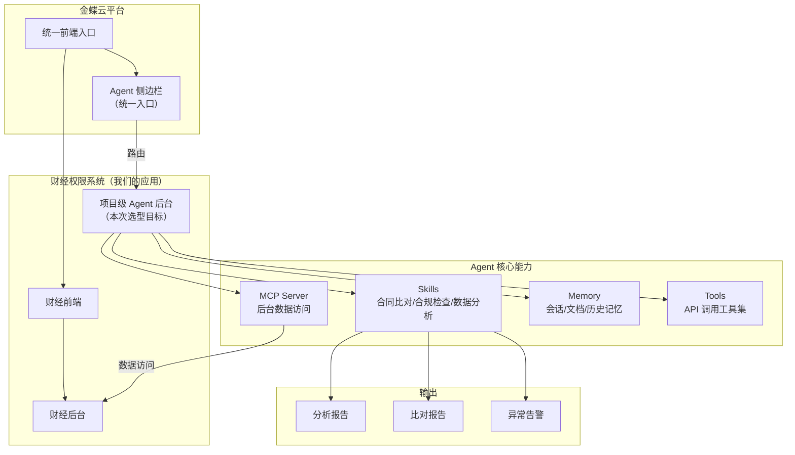

---

## 2. 系统架构全景图

### 2.1 Agent 与微前端集成架构

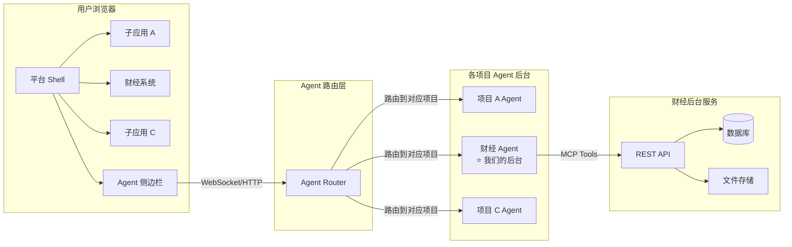

### 2.2 Agent 内部架构（目标态）

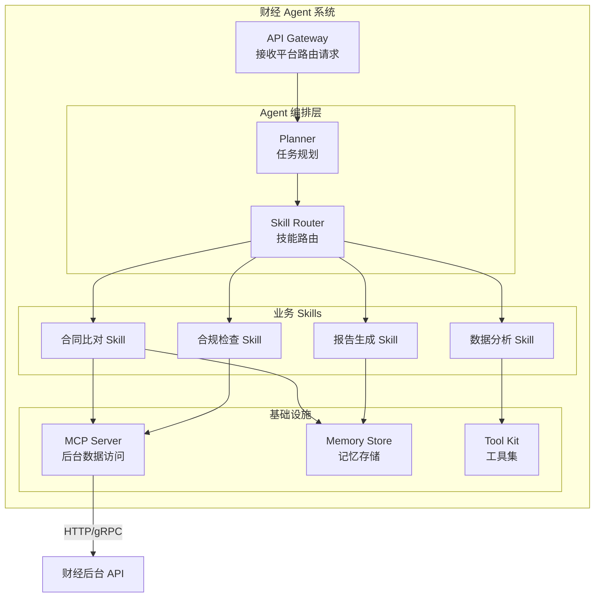

---

## 3. 候选框架概览

### 3.1 候选框架筛选

基于需求筛选出 **7 个候选框架** + 1 个排除项：

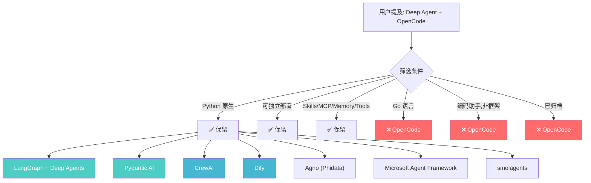

### 3.2 候选框架总览表

| 框架 | GitHub | Stars | 许可证 | 语言 | 架构模式 | 维护状态 |
|------|--------|-------|--------|------|---------|---------|
| **LangGraph + Deep Agents** | [langchain-ai/langgraph](https://github.com/langchain-ai/langgraph) | ~10k+ | MIT | Python | 有向图/状态机 | 活跃 |
| **Pydantic AI** | [pydantic/pydantic-ai](https://github.com/pydantic/pydantic-ai) | ~10k+ | MIT | Python | Agent-as-Capability | 活跃（快速迭代） |
| **CrewAI** | [crewAIInc/crewAI](https://github.com/crewAIInc/crewAI) | ~25k+ | MIT | Python | 角色 Agent + Flows | 活跃 |
| **Dify** | [langgenius/dify](https://github.com/langgenius/dify) | ~100k+ | Apache 2.0 (修改) | Python | 可视化工作流平台 | 活跃 |
| **Agno (Phidata)** | [agno-agi/agno](https://github.com/agno-agi/agno) | ~15k+ | MPL-2.0 | Python | 平台 SDK | 活跃 |
| **Microsoft Agent Framework** | [microsoft/agent-framework](https://github.com/microsoft/agent-framework) | 新项目 | MIT | Python + .NET | 多 Agent 编排 | 活跃 (2026.4 v1.0) |
| **smolagents** | [huggingface/smolagents](https://github.com/huggingface/smolagents) | ~15k+ | Apache 2.0 | Python | Code Agent (~1k LOC) | 活跃 |
| ~~OpenCode~~ | [opencode-ai/opencode](https://github.com/opencode-ai/opencode) | ~120k+ | FSL | **Go** | 终端编码助手 | **已归档** |

> **关于 OpenCode**: 基于 Go 语言的终端 AI 编码助手（类似 Claude Code），不是通用 Agent 框架，无 Python API，无法作为后端服务部署。**不推荐用于本项目。**

> **关于 "Deep Agent"**: 最可能指 LangChain 于 2026年3月发布的 **Deep Agents** (`langchain-ai/deepagents`)——一个基于 LangGraph 的"开箱即用" Agent 运行时框架。

---

## 4. 六维深度对比

### 4.1 雷达图（综合评分）

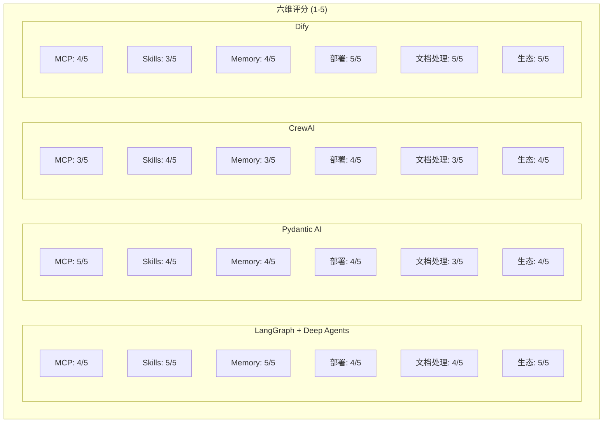

### 4.2 详细评分矩阵

| 维度 | LangGraph + Deep Agents | Pydantic AI | CrewAI | Dify | Agno | MAF | smolagents |
|------|:---:|:---:|:---:|:---:|:---:|:---:|:---:|
| **MCP 支持** | 4 | 5 | 3 | 4 | 3 | 4 | 4 |
| **Skills 扩展** | 5 | 4 | 4 | 3 | 4 | 4 | 3 |
| **Memory 管理** | 5 | 4 | 3 | 4 | 4 | 3 | 2 |
| **独立部署** | 4 | 4 | 4 | 5 | 4 | 3 | 3 |
| **文档处理/RAG** | 4 | 3 | 3 | 5 | 3 | 3 | 3 |
| **生态成熟度** | 5 | 4 | 4 | 5 | 3 | 2 | 3 |
| **金融合规适配** | 4 | 5 | 3 | 3 | 3 | 3 | 2 |
| **Python 友好度** | 5 | 5 | 5 | 4 | 5 | 5 | 5 |
| **总分** | **36** | **34** | **29** | **33** | **29** | **27** | **25** |

### 4.3 各维度详解

#### MCP 支持

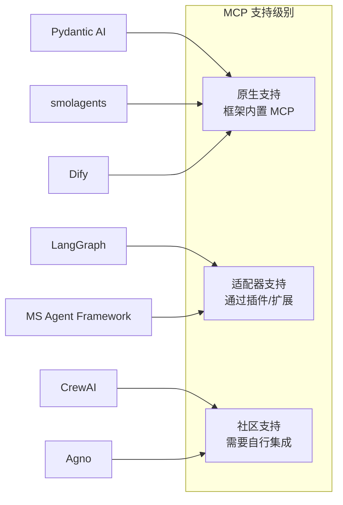

| 框架 | MCP 集成方式 | 说明 |
|------|------------|------|
| **Pydantic AI** | 原生 Capability | MCP 作为可组合的 Capability，一行代码添加 |
| **smolagents** | 原生支持 | 任何 MCP Server 的工具可直接使用 |
| **Dify** | 平台内置 | 在管理界面配置 MCP Server |
| **LangGraph** | LangChain MCP Adapter | 通过适配器在工具节点中使用 |
| **CrewAI** | 自定义工具包装 | 需要自行封装 MCP 工具 |
| **Agno** | 上下文提供程序 | MCP 作为上下文源接入 |

#### Skills / Tools 扩展

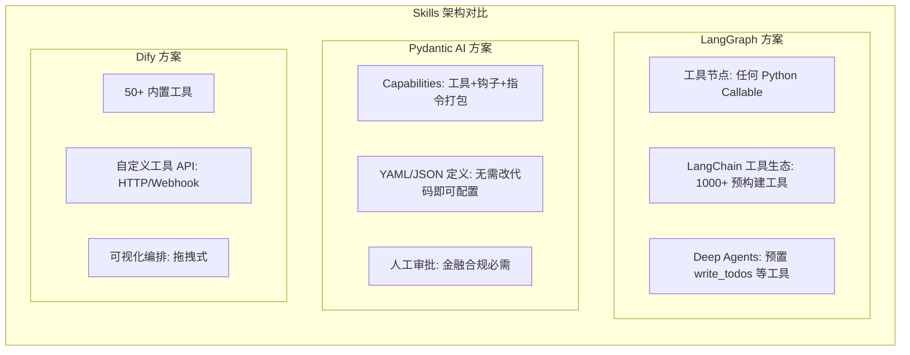

#### Memory 管理

| 框架 | 短期记忆 | 长期记忆 | 文件系统支持 | 持久化 |
|------|---------|---------|------------|--------|
| **LangGraph + Deep Agents** | 工作内存 | 持久化内存 | 文件系统后备 | Checkpointers |
| **Pydantic AI** | RunContext | 图状态 | Durable Execution | 支持 |
| **CrewAI** | Agent 内置 | RAG 知识库 | 有限 | 部分 |
| **Dify** | 会话管理 | 知识库 (RAG) | 内置 | 数据库 |
| **Agno** | 会话存储 | 知识存储 | 数据库存储 | 支持 |

---

## 5. 用户关注框架专项分析

### 5.1 Deep Agents (langchain-ai/deepagents)

> 这可能是用户提到的 "Deep Agent"

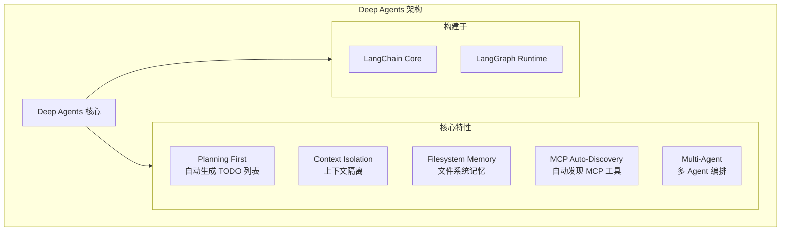

**评估**:
- **优势**: 开箱即用、MCP 原生支持、规划能力、记忆管理优秀
- **劣势**: 2026.3 才发布，较新；绑定 LangChain 生态
- **适用场景**: 长时间运行的复杂多步骤任务（如合同逐项比对）
- **GitHub**: [langchain-ai/deepagents](https://github.com/langchain-ai/deepagents)
- **评分**: 4/5

### 5.2 OpenCode (opencode-ai/opencode)

**评估结论**: 不推荐用于本项目

| 维度 | 评估 | 说明 |
|------|------|------|
| 定位 | 不适合 | 终端编码助手，类似 Claude Code / Cursor |
| 语言 | 不适合 | Go 语言，非 Python |
| 部署 | 不适合 | 桌面/终端应用，无后端服务 API |
| Agent 框架 | 不适合 | 不是通用 Agent 编排框架 |
| 状态 | 不适合 | **已归档** (Archive) |
| 继任者 | 需注意 | Crush (charmbracelet/crush)，FSL 许可证 |
| MCP | 有限 | 支持作为 MCP 客户端，但无法作为服务端 |

### 5.3 其他值得关注的框架

#### Pydantic AI -- 金融系统最佳候选

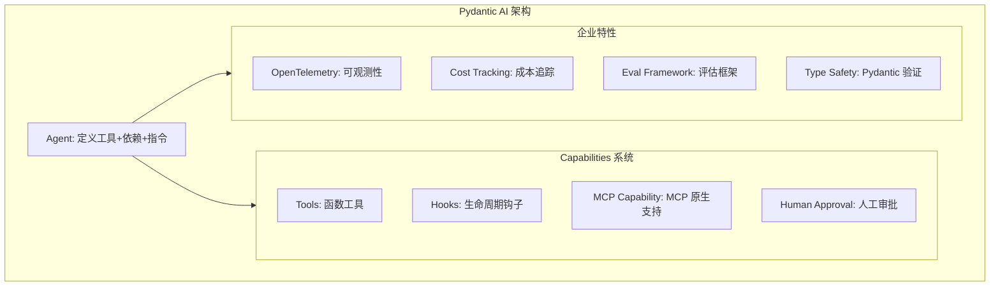

**关键优势**:
- **类型安全**: Pydantic 验证是 Python 金融系统的事实标准
- **人工审批**: 工具调用可配置人工介入（金融合规必需）
- **可观测性**: OpenTelemetry + 成本追踪（生产环境必需）
- **评估框架**: 内置回归测试能力
- **银行示例**: README 即包含银行系统示例

#### Dify -- 最快交付路径

**关键优势**:
- **可视化工作流**: 拖拽式 Agent 编排
- **内置 RAG**: 原生文档处理 Pipeline
- **50+ 工具**: Google Search, DALL-E, Wolfram Alpha 等开箱即用
- **Docker 部署**: 一键 `docker-compose up`
- **100k+ Stars**: 社区最大

**关键劣势**:
- **平台而非库**: 定制化受限于平台能力
- **修改许可证**: 非 MIT，有附加条款
- **代码控制有限**: 复杂金融逻辑可能受限

---

## 6. 技术架构推荐方案

### 6.1 推荐方案矩阵

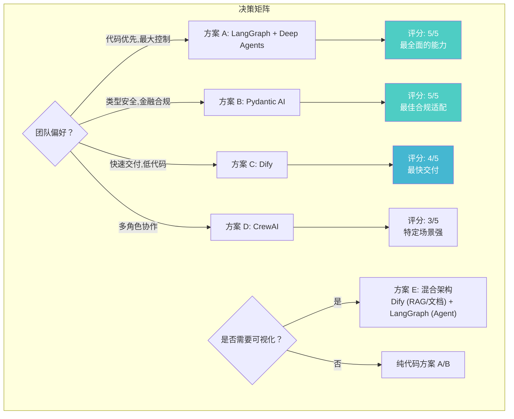

### 6.2 推荐方案 A: LangGraph + Deep Agents（首推）

**适用场景**: 团队有较强 Python 能力，追求最大灵活性和可控性。

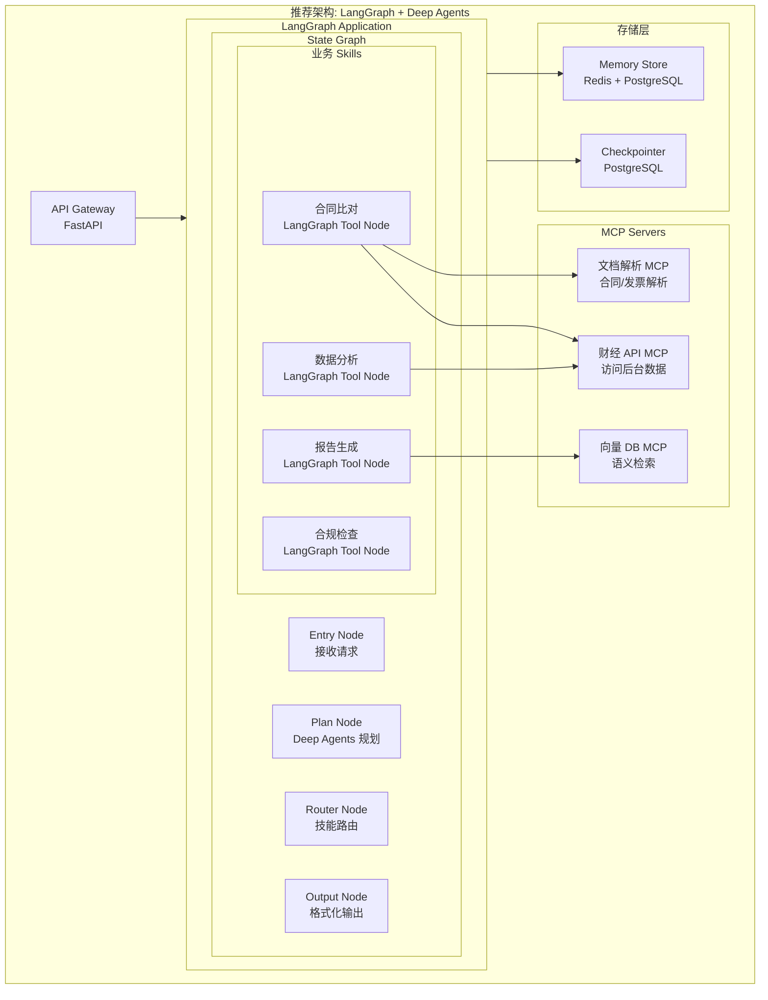

**技术栈**:
- **框架**: LangGraph + Deep Agents
- **Web 框架**: FastAPI
- **MCP Server**: FastMCP (Python)
- **数据库**: PostgreSQL (持久化) + Redis (缓存)
- **向量库**: pgvector 或 Milvus (文档检索)
- **部署**: Docker + Kubernetes
- **可观测性**: LangSmith

### 6.3 推荐方案 B: Pydantic AI（金融合规最优）

**适用场景**: 金融合规要求严格，需要类型安全和人工审批机制。

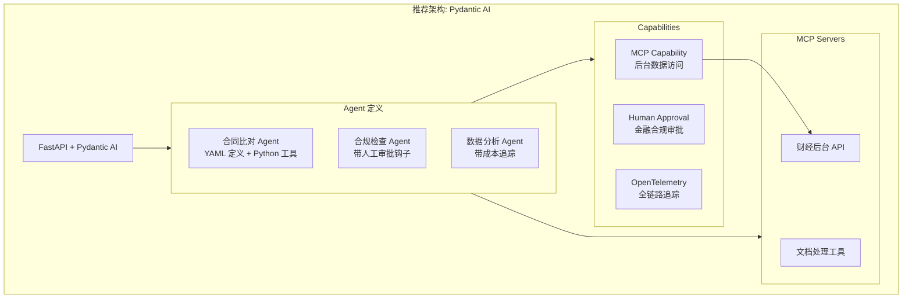

### 6.4 技术选型决策流程

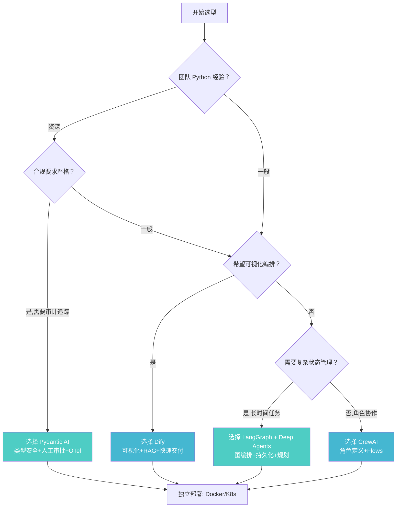

---

## 7. 实施路线图

### 7.1 分阶段实施计划

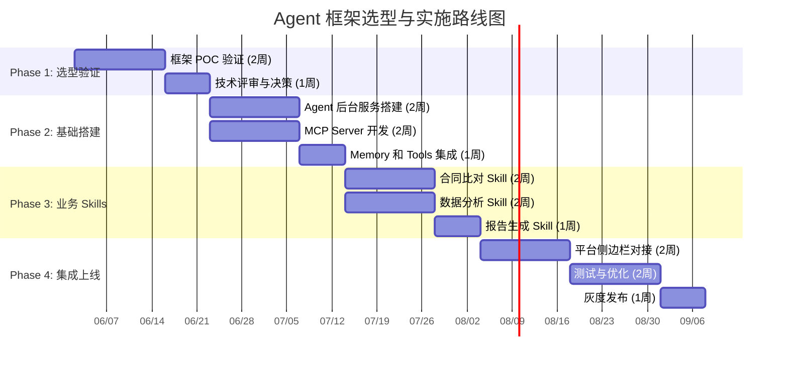

### 7.2 POC 验证清单

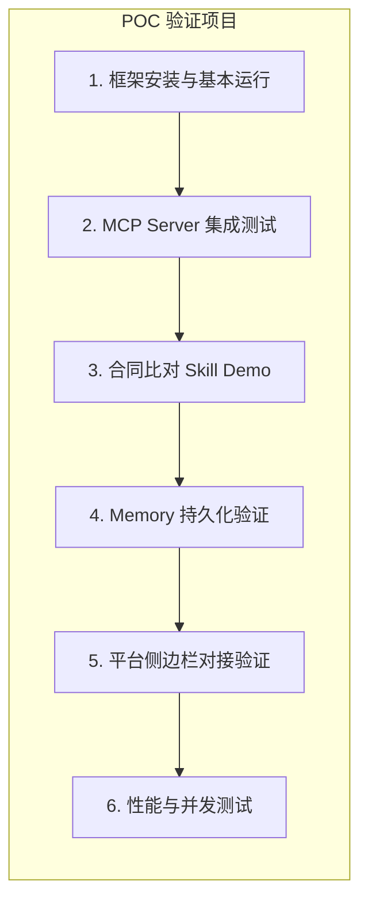

| POC 项目 | 验证目标 | 通过标准 |
|----------|---------|---------|
| 框架基本运行 | 安装、配置、运行 Agent | 30 分钟内跑通 Hello World |
| MCP 集成 | 连接后台 API 的 MCP Server | 成功调用财经后台数据 |
| 合同比对 Skill | 实现一个简单的合同比对 | 输出结构化比对结果 |
| Memory 持久化 | 会话跨请求保持 | 重启服务后恢复上下文 |
| 平台对接 | Agent 侧边栏路由到后台 | 成功接收和响应消息 |
| 性能测试 | 并发 10 用户文档比对 | 响应时间 < 30s |

---

## 8. 风险与决策建议

### 8.1 风险矩阵

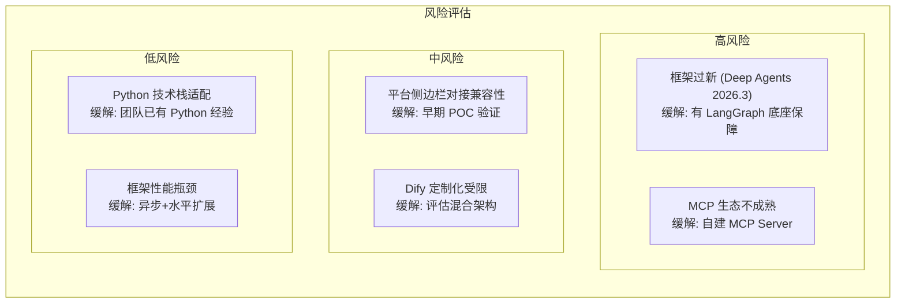

### 8.2 最终推荐

| 排名 | 方案 | 推荐理由 | 适用条件 |
|------|------|---------|---------|
| **1** | **LangGraph + Deep Agents** | 最全面的能力、MCP 原生、记忆管理优秀、生态成熟 | 团队有 Python 能力，追求可控性 |
| **2** | **Pydantic AI** | 金融合规最佳、类型安全、人工审批、可观测性 | 合规要求严格，需要审计追踪 |
| **3** | **Dify** | 最快交付、可视化、内置 RAG、100k+ 社区 | 团队偏好低代码，快速验证 |
| **4** | **CrewAI** | 多角色协作、MIT 许可、无 LangChain 依赖 | 多 Agent 角色分工场景 |

### 8.3 行动建议

1. **Phase 1 (第 1-2 周)**: 并行 POC LangGraph + Deep Agents 和 Pydantic AI
2. **Phase 1 末**: 技术评审会，团队投票选定框架
3. **Phase 2 (第 3-4 周)**: 基于选定框架搭建 Agent 后台 + MCP Server
4. **Phase 3 (第 5-8 周)**: 实现核心业务 Skills（合同比对、数据分析、报告生成）
5. **Phase 4 (第 9-12 周)**: 平台对接、测试、灰度发布

---

## 9. 参考来源

### 框架对比
1. [AI Agent Frameworks: LangGraph vs CrewAI vs AutoGen 2026](https://pecollective.com/blog/ai-agent-frameworks-compared/)
2. [Python AI Agent Frameworks Compared](https://pub.towardsai.net/i-compared-6-python-ai-agent-frameworks-so-you-dont-have-to-langgraph-vs-crewai-vs-pydanticai-vs-d8a5e6e43262)
3. [Comprehensive Comparison of Every AI Agent Framework in 2026](https://www.reddit.com/r/LangChain/comments/1rnc2u9/comprehensive_comparison_of_every_ai_agent/)
4. [AutoGen vs LangGraph vs CrewAI: Production Comparison](https://python.plainenglish.io/autogen-vs-langgraph-vs-crewai-a-production-engineers-honest-comparison-d557b3b9262c)
5. [CrewAI vs LangGraph vs AutoGen vs OpenAgents](https://openagents.org/blog/posts/2026-02-23-open-source-ai-agent-frameworks-compared)
6. [Top 7 AI Agent Frameworks for Developers in 2026](https://dev.to/thedailyagent/top-7-ai-agent-frameworks-for-developers-in-2026-3o63)

### Deep Agents
7. [LangChain Deep Agents Official](https://www.langchain.com/deep-agents)
8. [langchain-ai/deepagents GitHub](https://github.com/langchain-ai/deepagents)
9. [MCP Tools - LangChain Docs](https://docs.langchain.com/oss/python/deepagents/code/mcp-tools)
10. [LangChain Releases Deep Agents - MarkTechPost](https://www.marktechpost.com/2026/03/15/langchain-releases-deep-agents-a-structured-runtime-for-planning-memory-and-context-isolation-in-multi-step-ai-agents/)

### OpenCode
11. [opencode-ai/opencode GitHub](https://github.com/opencode-ai/opencode)
12. [OpenCode Developer Guide](https://lushbinary.com/blog/opencode-developer-guide-terminal-ai-coding-agent/)

### Dify
13. [langgenius/dify GitHub](https://github.com/langgenius/dify)
14. [7 Self-Hosted AI Tools](https://www.nocobase.com/cn/blog/7-self-hosted-ai-tools-build-business-app)

### MCP
15. [12 Frameworks to Build MCP AI Agents](https://blog.devgenius.io/12-frameworks-to-build-mcp-ai-agents-9fdfa3817e41)
16. [Agent Skills SDK GitHub](https://github.com/datalayer/agent-skills)

### Document Analysis
17. [FinAgent-RAG: Financial Document Analysis](https://arxiv.org/html/2605.05409v1)
18. [Financial Agentic RAG (LangGraph)](https://github.com/DeepakSilaych/Financial_Agentic_RAG)
19. [Agentic Document Extraction](https://medium.com/@vietexob/agentic-document-extraction-understanding-fe05fc2bba20)

### Other Frameworks
20. [Agno Official](https://www.agno.com/agent-framework)
21. [Microsoft Agent Framework GitHub](https://github.com/microsoft/agent-framework)
22. [Pydantic AI GitHub](https://github.com/pydantic/pydantic-ai)
23. [awesome-ai-agents-2026](https://github.com/ARUNAGIRINATHAN-K/awesome-ai-agents-2026)
24. [Best Open Source Agent Frameworks](https://www.ayautomate.com/blog/best-open-source-ai-agent-frameworks)

---

> **免责声明**: 本报告基于 2026 年 5-6 月的公开信息研究而成。各框架持续迭代，建议在决策前进行实际 POC 验证。部分 Star 数据为近似值，请以 GitHub 实时数据为准。
