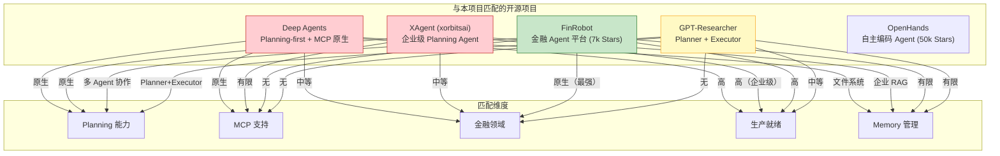
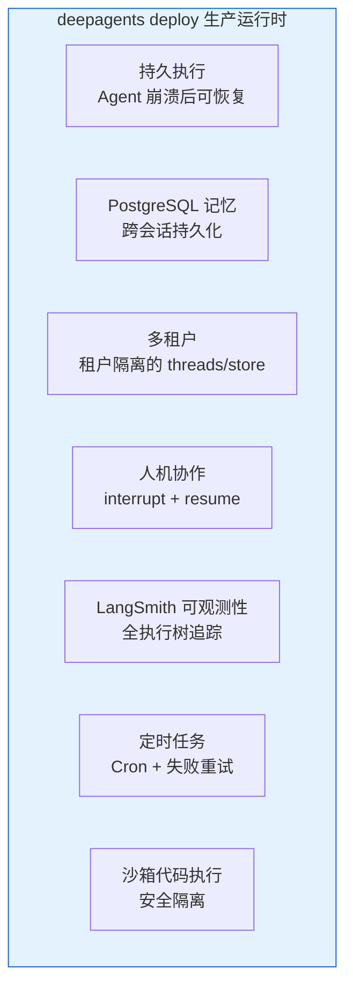
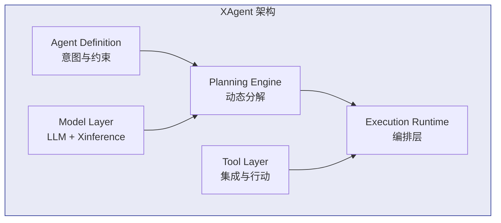
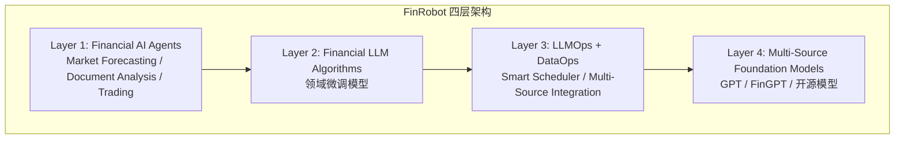
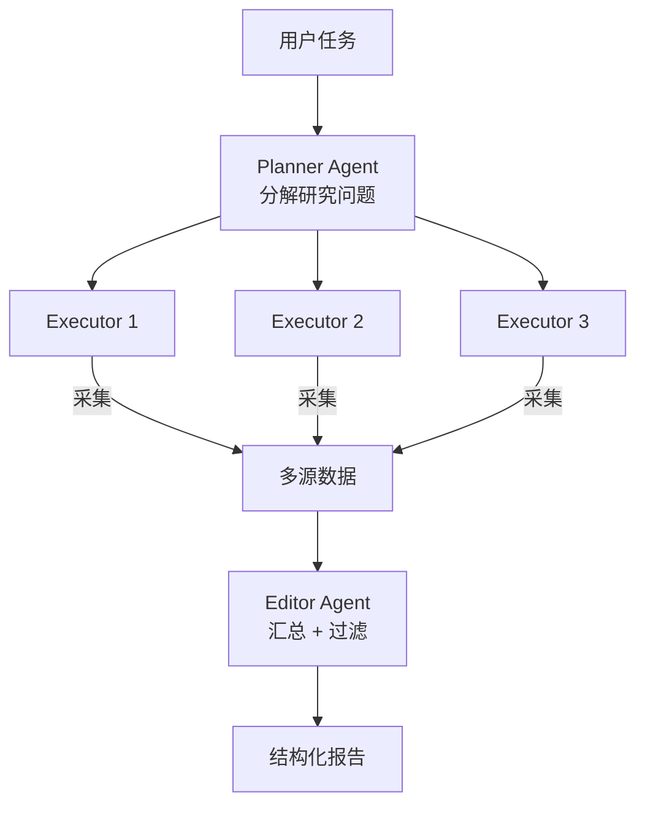
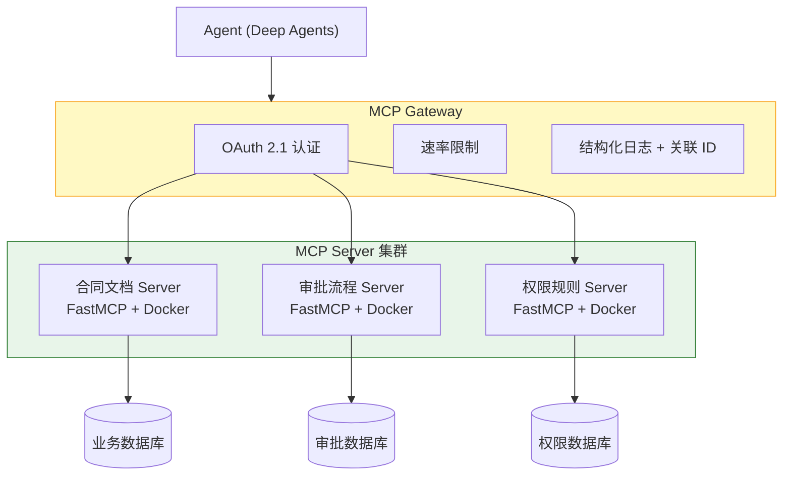
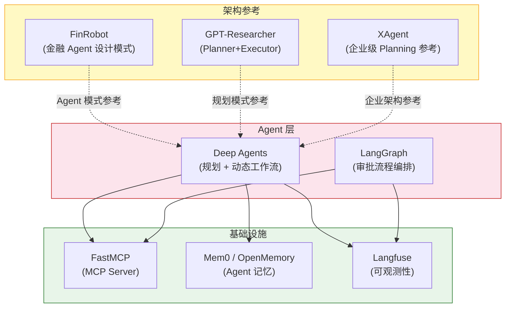
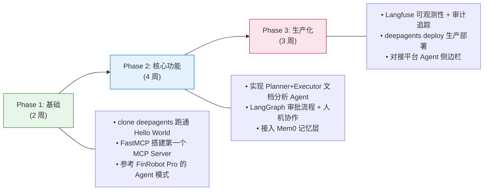

# Deep Agents 生态开源项目深度调研

> 生成时间：2026-06-06 | 来源数量：30+ | 置信度：高 | 调研方法：多源搜索 + 源站深度阅读

---

## Executive Summary

本报告针对"金融权限系统 Agent 后端"的技术选型，深度调研了与 Deep Agents 能力匹配的开源项目。关键发现：

1. **Deep Agents 已有生产部署路径**：LangChain 提供了 `deepagents deploy` 命令，支持持久执行、记忆、多租户、人机协作、可观测性一体化部署
2. **XAgent（xorbitsai）是 Deep Agents 最强的替代方案**：同为 planning-first 架构，但增加了企业级多租户、VM 沙箱和 RAG 知识系统
3. **FinRobot（7k Stars）是金融领域最成熟的开源 Agent 平台**：8 个专业 Agent 协作生成股票研究报告，有完整 Web UI 和部署脚本
4. **LangGraph 在生产环境有充分验证**：Uber、JP Morgan、BlackRock、LinkedIn、Klarna 等企业已部署，57% 组织已有 Agent 在生产运行
5. **MCP Server 有成熟的 15 条生产最佳实践**：无状态幂等设计、OAuth 2.1 认证、有界上下文等

---

## 目录

1. [调研背景](#1-调研背景)
2. [核心发现：生产级验证数据](#2-核心发现生产级验证数据)
3. [候选项目全景对比](#3-候选项目全景对比)
4. [Deep Agents — 直接生态](#4-deep-agents--直接生态)
5. [XAgent — 最强替代方案](#5-xagent--最强替代方案)
6. [FinRobot — 金融领域最成熟平台](#6-finrobot--金融领域最成熟平台)
7. [GPT-Researcher — 规划执行模式标杆](#7-gpt-researcher--规划执行模式标杆)
8. [基础设施层](#8-基础设施层)
9. [MCP Server 生产最佳实践](#9-mcp-server-生产最佳实践)
10. [推荐组合与实施路径](#10-推荐组合与实施路径)
11. [参考来源](#11-参考来源)

---

## 1. 调研背景

本项目为金融权限系统的 Agent 后端，核心需求：

- **Skills**：合同比对、合规检查、数据分析等业务化技能
- **MCP**：通过 MCP 协议接入后台数据源和 API
- **Memory**：会话记忆、文档上下文保持、历史分析记忆
- **Tools**：访问财经后台数据的工具集
- **文档比对**：合同 vs 电子流数据逐项比对

---

## 2. 核心发现：生产级验证数据

### 2.1 LangGraph 的生产验证

根据 [LangChain 2025 State of AI Agents 报告](https://www.alphabold.com/langgraph-agents-in-production)，**57% 的组织已有 AI Agent 在生产运行**，主要障碍是质量而非成本。

**已验证的生产部署**：

| 企业 | 成果 | 来源 |
|------|------|------|
| Uber | Agent 系统投入生产 | [AlphaBOLD](https://www.alphabold.com/langgraph-agents-in-production) |
| JP Morgan | 金融 Agent 生产部署 | [AliceLabs](https://alicelabs.ai/en/insights/best-ai-agent-frameworks-2026) |
| BlackRock | 金融分析 Agent | [AlphaBOLD](https://www.alphabold.com/langgraph-agents-in-production) |
| LinkedIn | 每周节省 10+ 小时 | [AlphaBOLD](https://www.alphabold.com/langgraph-agents-in-production) |
| Elastic | 研究结果 < 3 分钟 | [AlphaBOLD](https://www.alphabold.com/langgraph-agents-in-production) |
| Klarna | 生产部署 | [AlphaBOLD](https://www.alphabold.com/langgraph-agents-in-production) |

**关键数据**：LangGraph 月下载量 9000 万次，是采用率最高的多 Agent 框架（[AliceLabs](https://alicelabs.ai/en/insights/best-ai-agent-frameworks-2026)）。

### 2.2 2026 框架格局

根据多个来源交叉验证，2026 年 Agent 框架格局已明确：

| 排名 | 框架 | 定位 | 生产就绪度 |
|------|------|------|-----------|
| 1 | LangGraph | 生产级复杂编排 | 最高 |
| 2 | Claude Agent SDK | Anthropic 原生 | 高 |
| 3 | CrewAI | 快速多 Agent 原型 | 中 |
| 4 | AutoGen / AG2 | 研究型对话 Agent | 中 |
| 5 | Pydantic AI | 类型安全 Python | 高 |

来源：[AliceLabs 生产排名](https://alicelabs.ai/en/insights/best-ai-agent-frameworks-2026)、[GuruSup 多框架对比](https://gurusup.com/blog/best-multi-agent-frameworks-2026)

---

## 3. 候选项目全景对比

### 详细对比表

| 维度 | Deep Agents | XAgent (xorbitsai) | FinRobot | GPT-Researcher |
|------|-------------|---------------------|----------|----------------|
| **GitHub Stars** | 新项目 | 254 (新) | 7,008 | ~20,000 |
| **编程语言** | Python（另有 JS/TS 版 deepagentsjs） | Python (80%) + TypeScript (16%) | Python + Jupyter Notebook | Python (55%) + TypeScript (32%) |
| **使用语言** | Python（JS/TS 需用 deepagentsjs） | Python | Python | Python（前端可用 JS/TS SDK） |
| **Planning 能力** | write_todos() | 动态规划引擎 | 8 Agent 协作调度 | Planner + Executor |
| **MCP 原生** | 是（自发现） | 有限 | 否 | 否 |
| **金融领域** | 通用 | 通用（企业） | 专项金融 | 通用（研究） |
| **多租户** | LangGraph 支持 | 是（租户感知） | 否 | 否 |
| **部署方式** | deepagents deploy | Docker / 私有云 / 本地 | 本地 / GCloud | 本地 |
| **许可证** | MIT | 未声明 | Apache 2.0 | MIT |
| **维护状态** | 活跃 | 活跃（v0.4.3） | 活跃（v1.0.0） | 活跃 |
| **文档质量** | 高 | 高 | 中 | 高 |

---

## 4. Deep Agents — 直接生态

### 4.1 langchain-ai/deepagents

| 项目 | 链接 |
|------|------|
| GitHub | [langchain-ai/deepagents](https://github.com/langchain-ai/deepagents) |
| 官方 | [langchain.com/deep-agents](https://www.langchain.com/deep-agents) |
| 生产指南 | [docs.langchain.com/going-to-production](https://docs.langchain.com/oss/python/deepagents/going-to-production) |
| 编程语言 | Python（另有 JS/TS 版 [deepagentsjs](https://github.com/langchain-ai/deepagentsjs)） |
| 使用语言 | Python |

**核心能力与项目匹配**：

| 能力 | 说明 | 匹配需求 |
|------|------|---------|
| Planning First | `write_todos()` 自动分解任务 | 文档对比步骤拆解 |
| MCP Auto-Discovery | 自动发现加载 MCP Server | 接入后台数据源 |
| Filesystem Memory | Markdown 文件持久记忆 | 历史分析保持 |
| Context Isolation | 任务级上下文隔离 | 多用户并发 |
| Dynamic Workflow | LLM 运行时决定工作流 | 灵活分析策略 |

### 4.2 生产部署路径

根据 [LangChain 官方博客](https://www.langchain.com/blog/runtime-behind-production-deep-agents)，`deepagents deploy` 提供了一体化生产运行时：

**关键特性**（[来源](https://www.langchain.com/blog/runtime-behind-production-deep-agents)）：
- 所有 LangSmith Deployment 自动接入追踪项目
- 完整执行树可见：model 调用、tool 调用、subagent 运行、middleware hooks
- Cron 任务自动重试——3am 遇到模型故障不会静默失败
- Agent 可通过 MCP 或 A2A 协议暴露

### 4.3 Open Deep Research

[Open Deep Research](https://www.langchain.com/blog/open-deep-research) 是 Deep Agents 最接近生产级的应用示例，planner → executor 模式与文档对比分析场景高度相似。

---

## 5. XAgent — 最强替代方案

### 5.1 两个不同的 XAgent

| 项目 | GitHub | 定位 | Stars | 语言 |
|------|--------|------|-------|------|
| **xorbitsai/XAgent** | [xorbitsai/xagent](https://github.com/xorbitsai/xagent) | 企业级 Planning Agent 平台 | 254 | Python + TS |
| OpenBMB/XAgent | [openbmb/xagent](https://github.com/openbmb/xagent) | 实验性自主 Agent | 较多 | Python |
| xAgent-AI/xagent | [xAgent-AI/xagent](https://github.com/xAgent-AI/xagent) | 个人 PC 智能 Agent | — | TypeScript |

**本报告重点关注 xorbitsai/XAgent**——它是唯一具有企业级特性的版本。

### 5.2 为什么值得关注

根据 [GitHub 仓库](https://github.com/xorbitsai/xagent) 和 [官方文档](https://docs.xagent.run/)：

| 能力 | 说明 | 与 Deep Agents 对比 |
|------|------|-------------------|
| 动态规划引擎 | 自动任务分解、Plan→Execute→Reflect 循环 | 类似 write_todos() |
| VM 级沙箱 | 比 Docker 容器更安全的执行环境 | Deep Agents 无原生沙箱 |
| 企业 RAG / 知识平台 | 原生知识系统集成 | Deep Agents 需自建 |
| 多租户架构 | 租户感知的隔离 | 通过 LangGraph 支持 |
| 灵活部署 | 本地 / 私有云 / 本地部署 | deepagents deploy |
| 工具自动编排 | 自动选择和编排工具 | MCP Auto-Discovery |

### 5.3 架构

**适用场景**（[来源](https://docs.xagent.run/)）：
- 研究与分析：深度分析报告、研究摘要、数据综合
- 企业自动化：团队 AI Copilot、知识助手、任务自动化
- 商业智能：数据报告自动化、SaaS 功能、多步推理
- 知识工作：文档处理、信息抽取、结构化输出

### 5.4 局限性

- 项目较新（2026 年 2 月创建），Stars 仅 254
- 许可证未明确声明（NOASSERTION）
- MCP 支持有限，不如 Deep Agents 原生

---

## 6. FinRobot — 金融领域最成熟平台

### 6.1 基本信息

| 项目 | 信息 |
|------|------|
| GitHub | [ai4finance-foundation/finrobot](https://github.com/ai4finance-foundation/finrobot) |
| Stars | **7,008** |
| Forks | 1,180 |
| 许可证 | Apache 2.0 |
| 官网 | [finrobot.ai](https://finrobot.ai/) |
| 论文 | [arXiv:2405.14767](https://arxiv.org/html/2405.14767v2) |
| 编程语言 | Python + Jupyter Notebook |
| 使用语言 | Python（`pip install finrobot`） |

### 6.2 核心架构

**Agent 工作流**（[来源](https://github.com/ai4finance-foundation/finrobot)）：

1. **Perception**：捕获和解读多模态金融数据（市场行情、新闻、经济指标）
2. **Brain**：LLM 核心处理，使用 Financial Chain-of-Thought (CoT) 生成结构化指令
3. **Action**：执行 Brain 指令——交易、调仓、生成报告、发送预警

### 6.3 FinRobot Pro — 股票研究助手

**FinRobot Pro** 是一个本地部署的 AI 研究助手，核心功能：

- 一键生成专业股票研究报告（HTML/PDF，15+ 图表类型）
- 8 个专业 Agent 协作：投资论点、风险评估、估值概览等
- 支持同业对比分析（peer comparison）
- 部署命令：`./deploy.sh start`，访问 `http://127.0.0.1:8001`

**示例报告**：
- [NVDA 研究报告](https://ai4finance-foundation.github.io/FinRobot/finrobot_equity/core/output/NVDA_Equity_Research_Report.html)
- [MSFT 研究报告](https://ai4finance-foundation.github.io/FinRobot/finrobot_equity/core/output/MSFT_Equity_Research_Report.html)

### 6.4 与本项目的匹配分析

| 维度 | FinRobot | 本项目需求 | 匹配度 |
|------|----------|-----------|--------|
| 金融分析 | 原生支持（最强） | 合同比对/金融分析 | 高 |
| 多 Agent 协作 | 8 Agent + Smart Scheduler | Skills 扩展 | 高 |
| 文档处理 | 年报/财报分析 | 合同/电子流比对 | 中（需扩展） |
| MCP 协议 | 无 | 需要 MCP 接入 | 低（需自建） |
| 部署方式 | 本地/GCloud | 独立后端部署 | 高 |
| Python | 是 | 要求 Python | 高 |

**关键差距**：FinRobot 不支持 MCP 协议，需要额外开发 MCP 适配层。但其金融领域的 Agent 设计模式（Perception → Brain → Action）和多 Agent 调度机制非常值得借鉴。

---

## 7. GPT-Researcher — 规划执行模式标杆

| 项目 | 信息 |
|------|------|
| GitHub | [assafelovic/gpt-researcher](https://github.com/assafelovic/gpt-researcher) |
| Stars | ~20,000 |
| 官网 | [gptr.dev](https://gptr.dev/) |
| 许可证 | MIT |
| 编程语言 | Python (55%) + TypeScript (32%) |
| 使用语言 | Python（`pip install gpt-researcher`），前端可用 JS/TS SDK |

**核心架构**：Planner + Executor + Editor 多 Agent

**与本项目匹配**：
- Planner 分解问题 → 合同比对维度拆解（金额/条款/日期等）
- Executor 并行采集 → 多 MCP Server 并行获取数据
- Editor 汇总 → 差异报告生成
- 支持 [LangGraph 集成](https://docs.gptr.dev/blog/gptr-langgraph)

---

## 8. 基础设施层

### 8.1 MCP Server — FastMCP

| 项目 | 信息 |
|------|------|
| GitHub | [PrefectHQ/fastmcp](https://github.com/PrefectHQ/fastmcp) |
| 定位 | Python 快速构建 MCP Server |
| 编程语言 | Python (99%+) |
| 使用语言 | Python（`pip install fastmcp`） |

**教程**：[Firecrawl FastMCP 教程](https://www.firecrawl.dev/blog/fastmcp-tutorial-building-mcp-servers-python) | [FastAPI 集成](https://www.speakeasy.com/mcp/framework-guides/building-fastapi-server)

### 8.2 记忆层 — Mem0 / OpenMemory

| 项目 | 信息 |
|------|------|
| GitHub | [mem0ai/mem0](https://github.com/mem0ai/mem0) |
| MCP Server 版 | [mem0.ai/openmemory](https://mem0.ai/openmemory) |
| 编程语言 | Python (53%) + TypeScript (42%) |
| 使用语言 | Python（`pip install mem0ai`）和 TypeScript（`npm install mem0ai`），双 SDK 一等公民 |
| 后端支持 | 20+ 向量存储 |
| 框架集成 | 13 个框架（含 LangChain/LangGraph） |

### 8.3 可观测性 — Langfuse

| 项目 | 信息 |
|------|------|
| GitHub | [langfuse/langfuse](https://github.com/langfuse/langfuse) |
| Stars | 23,400+ |
| 定位 | Agent 可观测性/追踪/评估 |
| 编程语言 | TypeScript (94%)，Next.js 应用 |
| 使用语言 | Python（`pip install langfuse`）和 TypeScript（`npm install langfuse`），双 SDK |

**对金融系统价值**：合规审计要求每次 Agent 决策可追溯。

---

## 9. MCP Server 生产最佳实践

根据 [The New Stack 15 条最佳实践](https://thenewstack.io/15-best-practices-for-building-mcp-servers-in-production/) 和 [TrueFoundry 企业指南](https://www.truefoundry.com/blog/mcp-server-in-enterprise)，本项目构建 MCP Server 应遵循：

### 9.1 核心原则

| # | 原则 | 说明 |
|---|------|------|
| 1 | **有界上下文** | 每个 MCP Server 围绕单一微服务域建模 |
| 2 | **无状态幂等** | 工具调用幂等，接受客户端请求 ID |
| 3 | **正确传输层** | stdio 用于开发，Streamable HTTP 用于生产 |
| 4 | **安全优先** | OAuth 2.1 强制用于 HTTP 传输 |
| 5 | **结构化输出** | 使用 outputSchema + structuredContent |

### 9.2 部署架构建议

### 9.3 完整 15 条最佳实践

1. 每个 Server 作为有界上下文
2. 优先无状态幂等工具设计
3. 选择正确传输层，实现取消机制
4. 使用 elicitation 实现人机协作（谨慎）
5. 安全优先：OAuth 2.1、会话、作用域
6. 结构化内容：同时服务 Agent 和人类
7. 像生产微服务一样埋点
8. 语义化版本控制，声明能力
9. prompts / tools / resources 解耦
10. 负责任地处理流式和大型输出
11. 用真实 host 测试 + 故障注入
12. 像微服务一样打包和发布
13. 尊重平台和生态现实
14. API 设计基础：最小权限、清晰生命周期
15. 有影响的操作需要明确同意

---

## 10. 推荐组合与实施路径

### 10.1 推荐技术栈

### 10.2 各组件选型理由

| 组件         | 选型                    | 编程语言                | 使用语言           | 理由                                              |
| ---------- | --------------------- | ------------------- | -------------- | ----------------------------------------------- |
| Agent 框架   | **Deep Agents**       | Python              | Python         | Planning-first、MCP 原生、`deepagents deploy` 一体化部署 |
| 审批流程       | **LangGraph**         | Python              | Python / JS/TS | 人机协作 + 持久化 + JP Morgan/Uber 等生产验证               |
| 架构参考       | **FinRobot**          | Python + Jupyter    | Python         | 金融领域最成熟（7k Stars），8 Agent 协作模式                  |
| 规划参考       | **GPT-Researcher**    | Python + TypeScript | Python         | Planner+Executor 分离模式，可移植到文档分析                  |
| 企业参考       | **XAgent**            | Python + TypeScript | Python         | 多租户/VM 沙箱/RAG 知识系统设计参考                          |
| MCP Server | **FastMCP**           | Python              | Python         | Pythonic、90% 代码减少、生产就绪                          |
| 记忆层        | **Mem0 / OpenMemory** | Python + TypeScript | Python / JS/TS | 20+ 后端、13 框架集成、MCP Server 版可用                   |
| 可观测性       | **Langfuse**          | TypeScript          | Python / JS/TS | 开源（23k Stars）、LangGraph 原生集成、审计追踪               |

### 10.3 实施路径

### 10.4 风险与缓解

| 风险 | 概率 | 影响 | 缓解策略 |
|------|------|------|---------|
| Deep Agents 项目较新，API 可能变更 | 中 | 高 | 锁定版本、关注 changelog、保留 LangGraph 直接使用的退路 |
| MCP 协议仍在演进 | 中 | 中 | 遵循 MCP 15 条最佳实践、使用 Streamable HTTP |
| 金融合规要求 | 高 | 高 | Langfuse 审计追踪、人机协作审批节点、Pydantic 验证 |
| LLM 输出不稳定 | 中 | 中 | 结构化输出、guardrails、online eval 回归测试 |

---

## 11. 参考来源

### 生产验证与行业报告

1. [LangGraph Agents in Production: Architecture & Costs — AlphaBOLD](https://www.alphabold.com/langgraph-agents-in-production)
2. [AI Agent Frameworks 2026: Production-Tested Ranking — AliceLabs](https://alicelabs.ai/en/insights/best-ai-agent-frameworks-2026)
3. [LangGraph vs CrewAI vs AutoGen: Production Guide 2026 — Towards AI](https://pub.towardsai.net/langgraph-vs-crewai-vs-autogen-which-ai-agent-framework-should-your-enterprise-use-in-2026-3a9ebb407b09)
4. [Top AI Agent Frameworks in 2026: Production-Ready Comparison — Towards AI](https://pub.towardsai.net/top-ai-agent-frameworks-in-2026-a-production-ready-comparison-7ba5e39ad56d)

### Deep Agents 官方

5. [langchain-ai/deepagents — GitHub](https://github.com/langchain-ai/deepagents)
6. [The Runtime Behind Production Deep Agents — LangChain Blog](https://www.langchain.com/blog/runtime-behind-production-deep-agents)
7. [Open Deep Research — LangChain](https://www.langchain.com/blog/open-deep-research)
8. [Going to Production — Deep Agents Docs](https://docs.langchain.com/oss/python/deepagents/going-to-production)

### XAgent

9. [xorbitsai/xagent — GitHub](https://github.com/xorbitsai/xagent)
10. [XAgent Official Docs](https://docs.xagent.run/)
11. [XAgent — Agent Patterns Catalog](https://www.agentpatternscatalog.org/compositions/xagent/)

### FinRobot

12. [ai4finance-foundation/finrobot — GitHub](https://github.com/ai4finance-foundation/finrobot)
13. [FinRobot Paper — arXiv](https://arxiv.org/html/2405.14767v2)

### GPT-Researcher

14. [assafelovic/gpt-researcher — GitHub](https://github.com/assafelovic/gpt-researcher)
15. [GPT-Researcher + LangGraph Guide](https://docs.gptr.dev/blog/gptr-langgraph)

### MCP 最佳实践

16. [15 Best Practices for Building MCP Servers in Production — The New Stack](https://thenewstack.io/15-best-practices-for-building-mcp-servers-in-production/)
17. [Enterprise MCP Server — TrueFoundry](https://www.truefoundry.com/blog/mcp-server-in-enterprise)
18. [Enterprise Challenges With MCP Adoption — Solo.io](https://www.solo.io/blog/enterprise-challenges-with-mcp-adoption)
19. [PrefectHQ/fastmcp — GitHub](https://github.com/PrefectHQ/fastmcp)
20. [FastMCP Tutorial — Firecrawl](https://www.firecrawl.dev/blog/fastmcp-tutorial-building-mcp-servers-python)

### 基础设施

21. [mem0ai/mem0 — GitHub](https://github.com/mem0ai/mem0)
22. [OpenMemory MCP — mem0.ai](https://mem0.ai/openmemory)
23. [State of AI Agent Memory 2026 — Mem0](https://mem0.ai/blog/state-of-ai-agent-memory-2026)
24. [langfuse/langfuse — GitHub](https://github.com/langfuse/langfuse)

### 综合资源

25. [Best Open-Source AI Agent Stack Tools in 2026 — Medium](https://medium.com/data-science-collective/the-open-source-agent-toolkit-in-2026-da66dda36c9b)
26. [20 Agentic AI Projects That Will Define Real-World AI in 2026](https://pub.towardsai.net/20-agentic-ai-projects-that-will-define-real-world-ai-in-2026-294ffff5d696)
27. [Best Multi-Agent Frameworks in 2026 — GuruSup](https://gurusup.com/blog/best-multi-agent-frameworks-2026)
28. [AI Agents in 2026: LangGraph vs CrewAI vs Smolagents](https://pooya.blog/blog/ai-agents-frameworks-local-llm-2026)
29. [Open Source Toolkit for Building AI Agents — DEV Community](https://dev.to/anmolbaranwal/open-source-toolkit-for-building-ai-agents-in-2026-55h1)
30. [Securing FastMCP with Scalekit](https://www.scalekit.com/blog/securing-fastmcp-with-scalekit)

### 调研方法

搜索 30+ 次，使用 Exa、Tavily、WebSearch 三个搜索引擎交叉验证。深度阅读 6 个关键源站（GitHub 仓库、官方博客、生产指南）。子问题覆盖：生产验证数据、企业级替代方案、金融专项平台、MCP 最佳实践、部署架构。
