# LangChain / LangGraph / Deep Agents 三者关系与适用场景

> 生成时间：2026-06-04 | 研究来源：LangChain 官方文档、GitHub 仓库、社区分析

---

## 目录

1. [三层架构关系](#1-三层架构关系)
2. [LangChain — L1 基础层](#2-langchain--l1-基础层)
3. [LangGraph — L2 编排层](#3-langgraph--l2-编排层)
4. [Deep Agents — L3 应用框架层](#4-deep-agents--l3-应用框架层)
5. [三者对比](#5-三者对比)
6. [适用场景分析](#6-适用场景分析)
7. [技术选型决策树](#7-技术选型决策树)
8. [对本项目的建议](#8-对本项目的建议)

---

## 1. 三层架构关系

LangChain 生态采用**分层架构**设计，三者分别处于不同抽象层级：

```mermaid
graph TB
    subgraph L3["L3 — 应用框架层"]
        DA["Deep Agents<br/>规划驱动 · 动态工作流 · 文件记忆"]
    end

    subgraph L2["L2 — 编排层"]
        LG["LangGraph<br/>状态图 · 循环 · 持久化 · 人机协作"]
    end

    subgraph L1["L1 — 基础层"]
        LC["LangChain<br/>Models · Prompts · Chains · Tools · Memory"]
    end

    DA --> "构建于" --> LG
    LG --> "依赖" --> LC

    style L1 fill:#e8f5e9,stroke:#2e7d32,color:#1b5e20
    style L2 fill:#e3f2fd,stroke:#1565c0,color:#0d47a1
    style L3 fill:#fce4ec,stroke:#c62828,color:#b71c1c
```

| 层级 | 框架 | 定位 | 核心能力 |
|------|------|------|----------|
| L1 | LangChain | 基础构件块 | LLM 接口、Prompt 管理、Chain 组合、Tool 定义 |
| L2 | LangGraph | 工作流编排 | 状态图、循环/分支、持久化、人机协作 |
| L3 | Deep Agents | 应用级框架 | 规划优先、动态工作流、文件记忆、MCP 自发现 |

**关键依赖关系：**

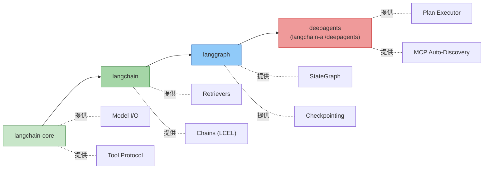

> **注意：** 自 LangChain v1.0 起，`AgentExecutor` 内部已由 LangGraph 驱动。即使你只使用 LangChain 的 Agent 功能，底层实际运行的也是 LangGraph 图。

---

## 2. LangChain — L1 基础层

### 2.1 核心架构

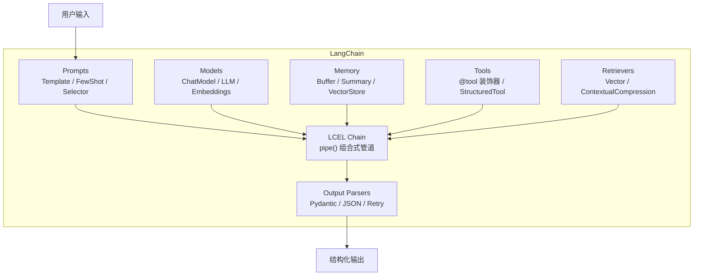

### 2.2 LCEL 管道模式

LangChain Expression Language (LCEL) 是 LangChain 的核心编排方式，采用**线性管道**风格：

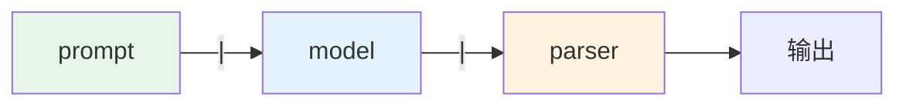

```python
# LCEL 示例：线性管道
chain = prompt | model | parser
result = chain.invoke({"question": "对比两份合同条款差异"})
```

### 2.3 适用场景

| 场景 | 说明 |
|------|------|
| 简单问答 / 对话 | prompt → model → parser 线性流程 |
| RAG 检索增强 | retriever + prompt + model 组合 |
| 工具调用 | 单次或顺序的工具链 |
| 结构化输出 | JSON / Pydantic 模型解析 |
| 原型验证 | 快速搭建 LLM 应用验证可行性 |

### 2.4 局限性

- **线性流程**：LCEL 本质是管道，不直接支持循环和条件分支
- **无状态持久化**：Memory 机制简单，不提供跨会话的 Checkpointing
- **Agent 执行受限**：复杂 Agent 行为需要 LangGraph 支持（v1.0 后内部已使用）

---

## 3. LangGraph — L2 编排层

### 3.1 核心概念

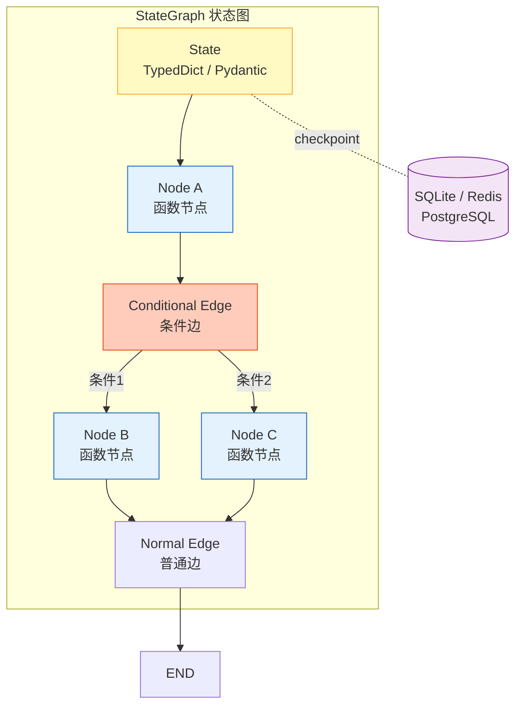

### 3.2 四大核心能力

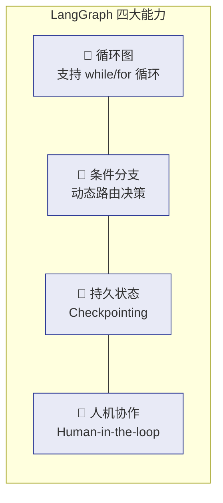

| 能力 | 说明 | 对比 LangChain |
|------|------|---------------|
| 循环图 | Agent 可以在"思考→行动→观察"之间反复循环 | LCEL 只有线性管道，无循环 |
| 条件分支 | 根据运行时状态动态选择路径 | Chain 只能顺序执行 |
| 持久状态 | Checkpointing 支持暂停/恢复、时间旅行 | Memory 仅简单的对话历史 |
| 人机协作 | Interrupt + Resume 模式 | 无原生支持 |

### 3.3 ReAct Agent 示例

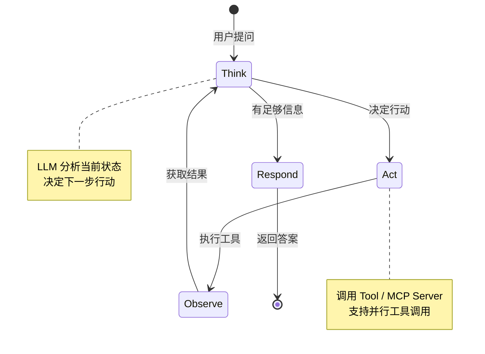

```python
# LangGraph 构建一个 ReAct Agent
from langgraph.prebuilt import create_react_agent
from langchain_core.tools import tool

@tool
def compare_documents(doc_a: str, doc_b: str) -> str:
    """对比两份文档的差异"""
    ...

graph = create_react_agent(model, tools=[compare_documents])
result = graph.invoke({"messages": [("user", "对比合同A和合同B")]})
```

### 3.4 适用场景

| 场景 | 说明 |
|------|------|
| 多步骤 Agent | ReAct / Plan-and-Execute 等复杂 Agent 模式 |
| 审批工作流 | 人机协作，支持中断/审批/恢复 |
| 多 Agent 协作 | Supervisor / Swarm 模式 |
| 长时间任务 | Checkpointing 支持跨会话持久化 |
| 自定义控制流 | 需要循环、分支、子图等复杂编排 |

### 3.5 局限性

- **图需要预定义**：所有节点和边在编译前必须确定
- **动态性有限**：运行时不能随意增删节点
- **需要手动管理**：状态定义、Checkpoint 配置、工具绑定等需要手动编码

---

## 4. Deep Agents — L3 应用框架层

### 4.1 来源与定位

Deep Agents（`langchain-ai/deepagents`）是 LangChain 官方团队于 **2026 年 3 月** 发布的应用级框架，构建在 LangGraph 之上。

### 4.2 核心架构

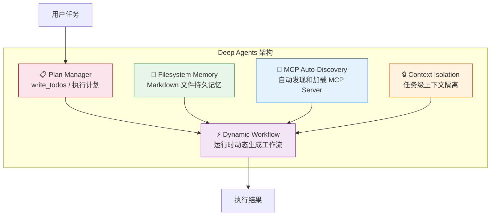

### 4.3 Planning First 模式

Deep Agents 最显著的特点是 **Planning First（规划优先）**：

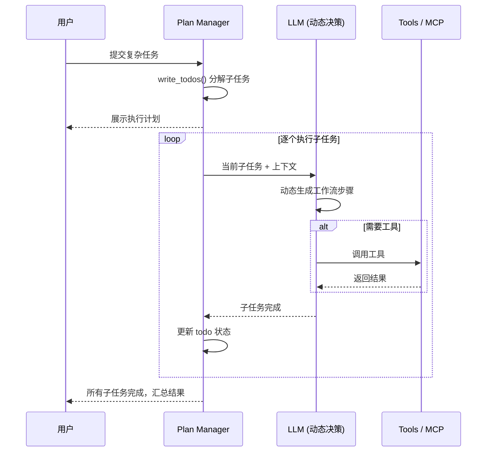

### 4.4 与 LangGraph 的关键区别

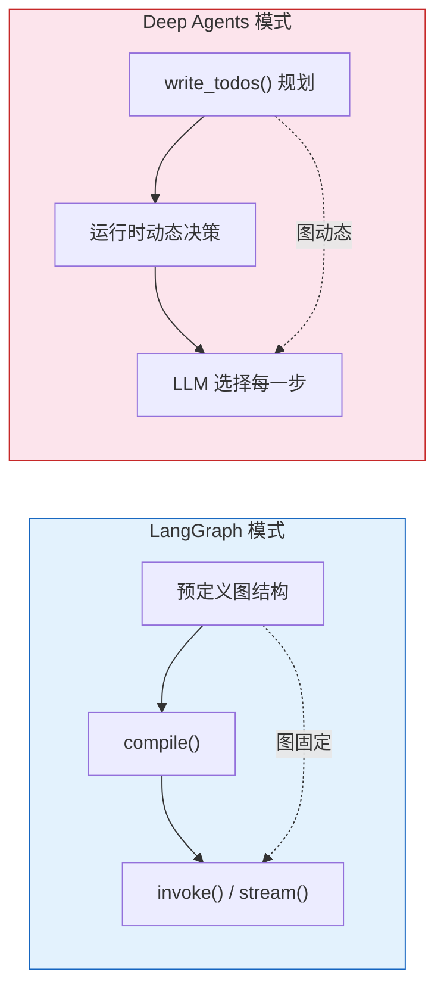

| 维度 | LangGraph | Deep Agents |
|------|-----------|-------------|
| 图定义 | 预定义，编译前确定 | 动态，LLM 运行时决定 |
| 灵活性 | 受限于预定义结构 | 可适应任意任务 |
| 可预测性 | 高（流程固定） | 中（依赖 LLM 决策质量） |
| 调试难度 | 较低（图可视化） | 较高（动态行为难追踪） |
| 适用复杂度 | 中等复杂工作流 | 高复杂度开放式任务 |

### 4.5 适用场景

| 场景 | 说明 |
|------|------|
| 开放式研究任务 | 任务路径不固定，需要 Agent 自主决策 |
| 多步骤代码生成 | 规划→编写→测试→修改的迭代循环 |
| 文档深度分析 | 对比、总结、提炼需要灵活调整策略 |
| 复杂数据处理 | 多源数据获取→清洗→分析→报告生成 |
| 自主 Agent | 需要 Agent 自主规划和执行的场景 |

### 4.6 局限性

- **项目较新**：2026 年 3 月发布，生态和社区仍在建设中
- **可预测性较低**：动态工作流依赖 LLM 决策，结果不完全可控
- **成本较高**：Planning 阶段和动态决策都需要额外的 LLM 调用
- **调试复杂**：动态行为比静态图更难追踪和调试

---

## 5. 三者对比

### 5.1 功能维度对比

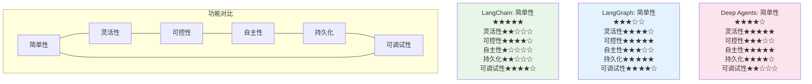

### 5.2 详细对比表

| 维度 | LangChain | LangGraph | Deep Agents |
|------|-----------|-----------|-------------|
| **定位** | LLM 应用构件块 | 工作流编排引擎 | 应用级 Agent 框架 |
| **抽象层级** | L1（底层） | L2（中层） | L3（高层） |
| **控制流** | 线性管道（LCEL） | 预定义状态图 | 运行时动态决策 |
| **循环支持** | 否 | 是 | 是 |
| **条件分支** | 否（需自定义） | 是（conditional edges） | 是（LLM 决策） |
| **状态持久化** | 简单 Memory | Checkpointing | 文件系统记忆 |
| **人机协作** | 否 | 是（interrupt/resume） | 是（计划审批） |
| **MCP 支持** | 通过 Community | 是 | 是（自动发现） |
| **规划能力** | 否 | 手动实现 | 是（write_todos） |
| **学习曲线** | 低 | 中 | 中低 |
| **成熟度** | 高（v0.1 起步至今） | 高（2024 年发布） | 新（2026 年 3 月） |

### 5.3 代码复杂度对比

以"对比两份合同并生成报告"为例：

```mermaid
graph TB
    subgraph LC_CODE["LangChain 方案<br/>~30 行"]
        LC_1["1. 构建 prompt template"]
        LC_2["2. 加载文档 → retriever"]
        LC_3["3. chain = prompt | model | parser"]
        LC_4["4. chain.invoke()"]
    end

    subgraph LG_CODE["LangGraph 方案<br/>~80 行"]
        LG_1["1. 定义 State TypedDict"]
        LG_2["2. 定义节点函数"]
        LG_3["3. 构建 StateGraph + edges"]
        LG_4["4. 编译并配置 checkpointer"]
        LG_5["5. graph.invoke()"]
    end

    subgraph DA_CODE["Deep Agents 方案<br/>~20 行"]
        DA_1["1. 配置 Agent + MCP Server"]
        DA_2["2. agent.invoke(task)"]
        DA_3["3. 自动规划→执行→报告"]
    end

    LC_1 --> LC_2 --> LC_3 --> LC_4
    LG_1 --> LG_2 --> LG_3 --> LG_4 --> LG_5
    DA_1 --> DA_2 --> DA_3

    style LC_CODE fill:#e8f5e9,stroke:#2e7d32
    style LG_CODE fill:#e3f2fd,stroke:#1565c0
    style DA_CODE fill:#fce4ec,stroke:#c62828
```

---

## 6. 适用场景分析

### 6.1 场景映射

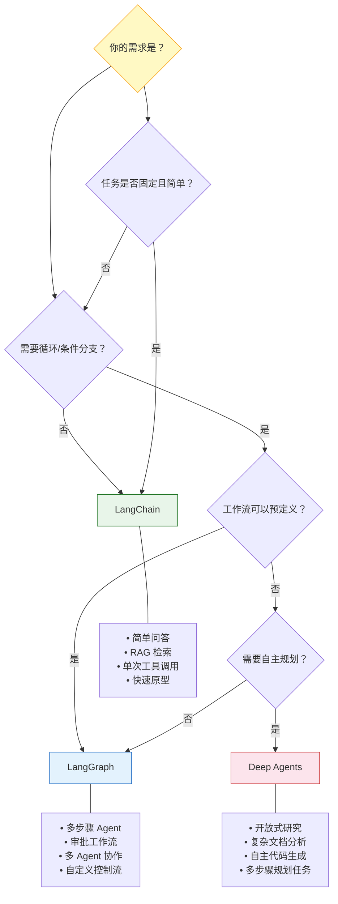

### 6.2 各框架典型用例

#### LangChain 适合

| 用例 | 实现方式 |
|------|----------|
| 客服对话机器人 | ConversationalRetrievalChain |
| 文档问答系统 | RetrievalQA + VectorStore |
| 结构化数据提取 | prompt + PydanticOutputParser |
| API 调用封装 | @tool + Agent |

#### LangGraph 适合

| 用例 | 实现方式 |
|------|----------|
| 报销审批 Agent | StateGraph + interrupt/resume |
| 多角色协作写作 | Supervisor + Sub-agents |
| 代码审查流水线 | 多节点图 + 条件边 |
| 客户服务 Agent | ReAct + Tool 调用 + 人机协作 |

#### Deep Agents 适合

| 用例 | 实现方式 |
|------|----------|
| 竞品分析报告 | Planning + 多源数据 + 自动生成 |
| 法律文档对比 | 规划→提取→对比→报告 |
| 技术调研 | 自主搜索→阅读→总结→生成 |
| 自动化测试生成 | 规划→编码→运行→修复循环 |

---

## 7. 技术选型决策树

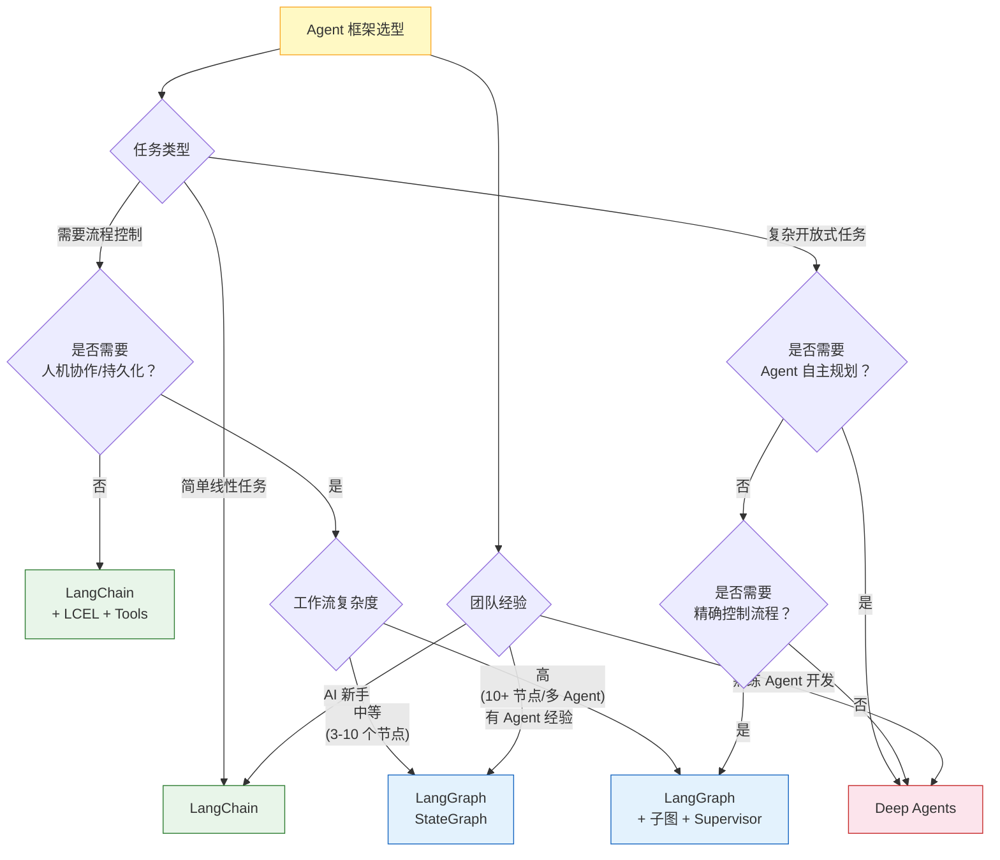

---

## 8. 对本项目的建议

### 8.1 项目背景

本项目为金融权限系统，运行在类似金蝶云平台的微前端架构中：

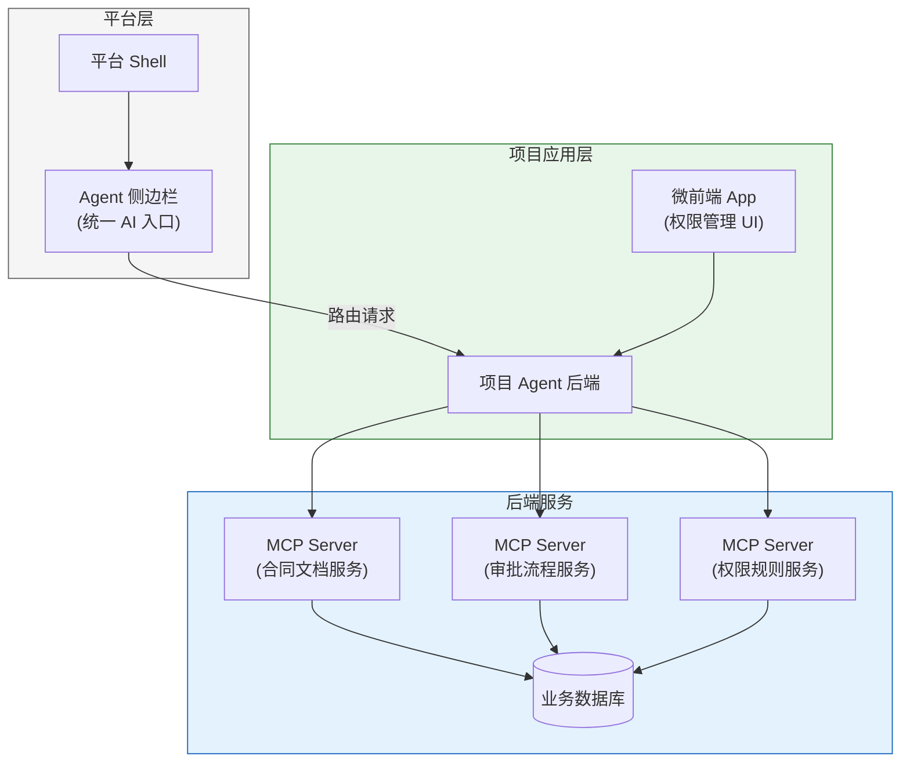

### 8.2 推荐方案

**推荐：LangGraph + Deep Agents 组合**

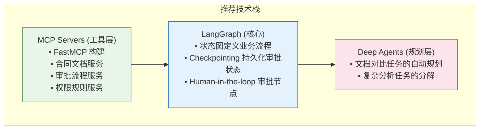

### 8.3 选择理由

| 需求 | 选型 | 理由 |
|------|------|------|
| 审批流程 | LangGraph | 需要预定义流程 + 人机协作 + 状态持久化 |
| 文档对比分析 | Deep Agents | 任务路径不固定，需要动态规划 |
| 工具调用 | MCP + LangChain Tools | 标准化接口，统一管理 |
| 对话管理 | LangGraph State | 多轮对话状态管理 |

### 8.4 不推荐单独使用 LangChain 的原因

虽然 LangChain 可以快速搭建原型，但本项目需要：
- **循环决策**（Agent 反复分析文档） → 需要 LangGraph
- **审批中断**（对比结果需要人工确认） → 需要 LangGraph
- **任务规划**（复杂文档分析需要分解步骤） → 需要 Deep Agents
- **状态持久化**（审批流程跨会话） → 需要 LangGraph Checkpointing

---

## 附录

### A. 框架版本信息

| 框架 | 最新版本 | 发布周期 | 许可证 |
|------|---------|---------|--------|
| LangChain | v0.3.x | 2 周一次 | MIT |
| LangGraph | v0.4.x | 1-2 周一次 | MIT |
| Deep Agents | v0.1.x | 新项目 | MIT |

### B. 学习资源

| 资源 | 链接 |
|------|------|
| LangChain 官方文档 | https://python.langchain.com/ |
| LangGraph 官方文档 | https://langchain-ai.github.io/langgraph/ |
| Deep Agents 仓库 | https://github.com/langchain-ai/deepagents |
| LangChain Academy | https://academy.langchain.com/ |

### C. 术语表

| 术语 | 含义 |
|------|------|
| LCEL | LangChain Expression Language，管道式组合语法 |
| StateGraph | LangGraph 的核心数据结构，有向状态图 |
| Checkpointing | LangGraph 的状态持久化机制 |
| ReAct | Reasoning + Acting，思考-行动循环模式 |
| MCP | Model Context Protocol，模型上下文协议 |
| write_todos | Deep Agents 的任务规划原语 |
| Human-in-the-loop | 人机协作，允许人工介入 Agent 流程 |
