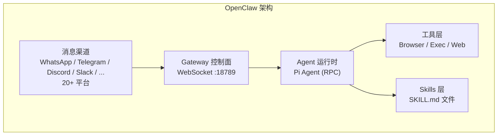
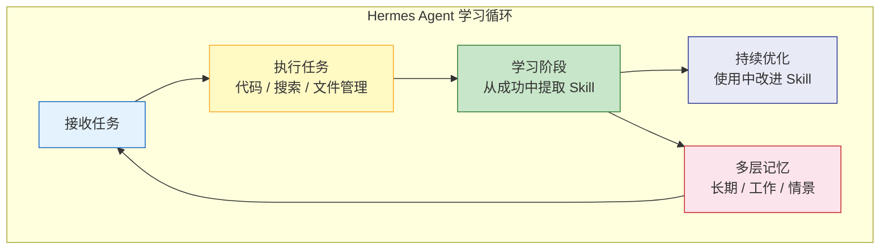
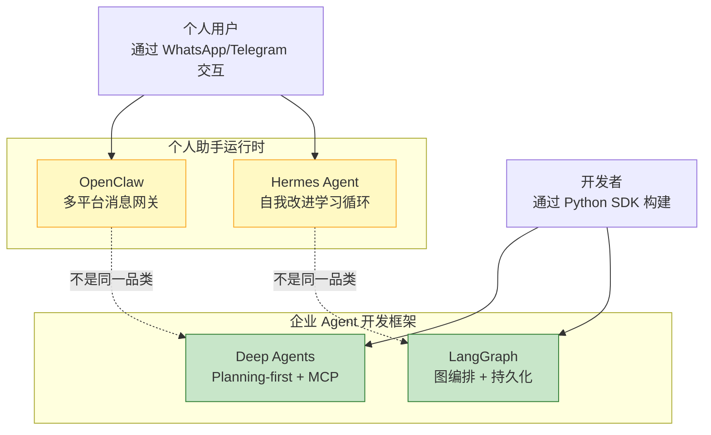
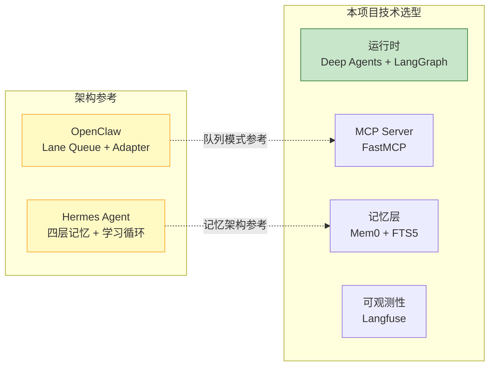

# OpenClaw 与 Hermes Agent 企业适配性深度调研

> 生成时间：2026-06-06 | 来源数量：25+ | 置信度：高 | 调研方法：Exa + Tavily + WebSearch + GitHub 三引擎交叉验证

---

## Executive Summary

针对"OpenClaw 和 Hermes Agent 是否适合金融权限系统 Agent 后端的企业级落地"这一问题，经过深度调研，**结论是两者均不适合直接用于企业 Agent 后端开发，但各自有值得借鉴的架构思想**。

1. **OpenClaw（280K+ Stars）** 和 **Hermes Agent（182K Stars）** 是 2026 年最热门的两个开源 AI Agent 项目，但它们本质上是**个人 AI 助手运行时**，不是企业级 Agent 开发框架
2. 两者都是"开箱即用的自治 Agent"，用户通过聊天平台与 Agent 交互——而不是开发者用 SDK 构建自定义 Agent 应用
3. 本项目需要的是一个**Agent 开发框架**（如 Deep Agents / LangGraph），用于构建业务特定的 Agent 后端——这是完全不同的品类

---

## 目录

1. [调研背景](#1-调研背景)
2. [OpenClaw 深度分析](#2-openclaw-深度分析)
3. [Hermes Agent 深度分析](#3-hermes-agent-深度分析)
4. [OpenClaw vs Hermes Agent 对比](#4-openclaw-vs-hermes-agent-对比)
5. [企业适配性评估](#5-企业适配性评估)
6. [可借鉴的架构思想](#6-可借鉴的架构思想)
7. [结论与建议](#7-结论与建议)
8. [参考来源](#8-参考来源)

---

## 1. 调研背景

### 1.1 本项目需求

金融权限系统 Agent 后端的核心需求：
- **Skills**：合同比对、合规检查、数据分析等业务化技能
- **MCP**：通过 MCP 协议接入后台数据源和 API
- **Memory**：会话记忆、文档上下文保持
- **Tools**：访问财经后台数据的工具集
- **企业级要求**：多租户、可审计、合规、人机协作

### 1.2 调研问题

OpenClaw 和 Hermes Agent 热度极高（合计 460K+ Stars），它们是否适合本项目的技术选型？

---

## 2. OpenClaw 深度分析

### 2.1 基本信息

| 维度 | 信息 |
|------|------|
| GitHub | [openclaw/openclaw](https://github.com/openclaw/openclaw) |
| Stars | **280,000+** |
| 创始人 | Peter Steinberger（奥地利开发者，PDF 工具 13 年经验） |
| 现状 | 2026 年 2 月加入 OpenAI，项目转入开源基金会 |
| 编程语言 | TypeScript / Node.js |
| 使用语言 | TypeScript / Node.js |
| 许可证 | MIT |

### 2.2 核心定位

> **OpenClaw is a personal AI assistant you run on your own devices.**（[GitHub README](https://github.com/openclaw/openclaw)）

OpenClaw 是一个**本地优先的个人 AI 助手**，通过 WhatsApp / Telegram / Discord 等消息平台与用户交互。它不是一个开发者用来构建自定义 Agent 应用的 SDK。

### 2.3 不适合企业 Agent 后端的原因

| 问题 | 详情 | 来源 |
|------|------|------|
| **品类不匹配** | 个人助手运行时，不是 Agent 开发框架 | [SFAI Labs](https://sfailabs.com/guides/openclaw-ai-agent-framework) |
| **无企业治理** | 无审批工作流、合规日志、决策边界 | [BMD PAT](https://bmdpat.com/blog/openclaw-ai-agent-review-2026) |
| **安全风险** | ClawHub 13,000+ Skills 中约 12% 为恶意（341/2857） | [CSA Security](https://labs.cloudsecurityalliance.org/research/csa-research-note-hermes-agent-cves-20260504-csa-styled) |
| **TypeScript 生态** | 本项目以 Python 为主 | [GitHub](https://github.com/openclaw/openclaw) |
| **单用户设计** | 默认绑定 `127.0.0.1:18789`，无原生多租户 | [官方架构文档](https://docs.openclaw.ai/concepts/architecture) |
| **无 SLA** | 开源项目，无运维保障 | [BMD PAT](https://bmdpat.com/blog/openclaw-ai-agent-review-2026) |

---

## 3. Hermes Agent 深度分析

### 3.1 基本信息

| 维度 | 信息 |
|------|------|
| GitHub | [NousResearch/hermes-agent](https://github.com/NousResearch/hermes-agent) |
| Stars | **182,454** |
| 团队 | Nous Research（Web3 加密 + 开源 AI） |
| 发布时间 | 2026 年 2 月 25 日 |
| 增长速度 | 42 天内 47,000 Stars（历史最快之一） |
| 编程语言 | Python (83.8%) + TypeScript (12.2%) |
| 使用语言 | Python（主要） |
| 许可证 | MIT |
| 企业版 | ClawPro（通过腾讯云企业服务提供） |

### 3.2 核心定位

> **Hermes Agent is the self-improving AI agent built by Nous Research. It creates skills from experience, improves them during use, and builds a deepening model of who you are across sessions.**（[GitHub README](https://github.com/NousResearch/hermes-agent)）

Hermes Agent 与 OpenClaw 属于同一品类——**个人/自治 AI 助手**，但增加了**自我改进学习循环**。

### 3.3 架构特性

根据 [Hackernoon 深度对比](https://hackernoon.com/hermes-agent-vs-openclaw-which-ai-agent-framework-wins-in-2026) 和 [Tencent Cloud 评估](https://www.tencentcloud.com/techpedia/144032)：

| 特性 | 说明 |
|------|------|
| **四层记忆架构** | 长期语义记忆 + 工作记忆 + 情景日志 + FTS5 全文检索（中位 10ms / 10K+ 条目） |
| **自我生成 Skills** | 从任务完成中自动创建可复用 Skill（非社区下载，避免了 ClawHub 的恶意 Skill 风险） |
| **持续优化** | 使用中自动改进 Skill，2-3 倍执行速度提升 |
| **云端原生** | 5 美元 VPS 或 GPU 集群均可运行，不依赖本地设备 |
| **16+ 消息平台** | Telegram、Discord、Slack、WhatsApp、Signal、Email 等 |
| **模型无关** | Nous Portal、OpenRouter（200+ 模型）、OpenAI、本地模型等 |

### 3.4 企业部署案例

| 平台 | 说明 | 来源 |
|------|------|------|
| **腾讯云 Lighthouse** | 一键部署模板，首个主流云厂商官方支持 | [Tencent Cloud](https://www.tencentcloud.com/techpedia/144032) |
| **Red Hat OpenShift AI** | 企业级 vLLM 模型服务 + GPU 多租户 + RBAC + 审计日志 | [Red Hat](https://developers.redhat.com/articles/2026/06/02/deploy-hermes-agent-openshift-ai-vllm-model-serving) |
| **NVIDIA RTX / DGX Spark** | RTX PC 和工作站本地运行 | [NVIDIA Blog](https://blogs.nvidia.com/blog/rtx-ai-garage-hermes-agent-dgx-spark) |
| **Enterprise ClawPro** | 腾讯云企业版 Hermes Agent 平台 | [Tencent Cloud](https://www.tencentcloud.com/techpedia/144032) |

### 3.5 不适合企业 Agent 后端的原因

| 问题 | 详情 | 来源 |
|------|------|------|
| **品类不匹配** | 个人自治助手，不是 Agent 开发 SDK | [Pickaxe](https://pickaxe.co/post/top-ai-agent-frameworks) |
| **安全 CVE** | 3 个 CVE（2026 年 4 月），含路径遍历和认证绕过 | [CSA Security](https://labs.cloudsecurityalliance.org/research/csa-research-note-hermes-agent-cves-20260504-csa-styled) |
| **活跃开发中** | 快速迭代导致频繁 Breaking Changes | [PetronellaTech](https://petronellatech.com/blog/hermes-agent-ai-guide) |
| **无 MCP 原生** | 不支持 MCP 协议作为 Agent 工具接入标准 | [GitHub](https://github.com/NousResearch/hermes-agent) |
| **无审批工作流** | 缺乏 HITL（人机协作）审批节点 | 与 LangGraph 对比 |
| **无多租户隔离** | 面向个人用户，无租户级隔离 | 架构设计 |

---

## 4. OpenClaw vs Hermes Agent 对比

### 4.1 直接对比

| 维度 | OpenClaw | Hermes Agent |
|------|----------|-------------|
| **Stars** | 280K+ | 182K+ |
| **发布时间** | 2025 年底 | 2026 年 2 月 |
| **创始团队** | Peter Steinberger → OpenAI | Nous Research（Web3 + AI） |
| **编程语言** | TypeScript | Python (84%) + TypeScript (12%) |
| **核心差异** | 多平台消息网关 | 自我改进学习循环 |
| **Skills 来源** | ClawHub 社区市场（13K+，12% 恶意） | 自动生成（无供应链风险） |
| **记忆** | 平面文件（MD + YAML + JSONL） | 四层架构（语义 + 工作 + 情景 + FTS5） |
| **记忆检索** | sqlite-vec + FTS5 | FTS5（中位 10ms / 10K+ 条目） |
| **企业部署** | 本地守护进程 | 腾讯云 / OpenShift / NVIDIA |
| **CVE 记录** | 9 个 CVE（2026 年 3 月，含 CVSS 9.9） | 3 个 CVE（2026 年 4 月） |
| **企业版** | 无 | ClawPro（腾讯云企业服务） |
| **适合场景** | 个人多平台助手 | 个人自治助手 + 持续学习 |

### 4.2 两者与 Deep Agents / LangGraph 的品类差异

> **关键区别**：OpenClaw / Hermes Agent 是**消费者产品**（用户通过聊天使用），Deep Agents / LangGraph 是**开发者工具**（开发者通过 SDK 构建应用）。

---

## 5. 企业适配性评估

### 5.1 四维评估矩阵

| 评估维度 | 本项目需求 | Deep Agents | OpenClaw | Hermes Agent |
|----------|-----------|:---:|:---:|:---:|
| **品类匹配** | Agent 开发框架 | ✅ | ❌ | ❌ |
| **MCP 原生** | 需要 MCP 接入 | ✅ | ❌ | ❌ |
| **Memory 系统** | 会话 + 文档记忆 | ✅ | ⚠️ | ✅ |
| **多租户** | 企业隔离 | ✅ | ❌ | ❌ |
| **审批 HITL** | 合规审批流程 | ✅ | ❌ | ❌ |
| **可观测性** | 审计追踪 | ✅ | ⚠️ | ⚠️ |
| **生产部署** | 服务器集群 | ✅ | ⚠️ | ⚠️ |
| **Python** | 主技术栈 | ✅ | ❌ | ✅ |
| **安全合规** | 金融级 | ⚠️ | ❌ | ⚠️ |

### 5.2 综合评分

| 框架 | 企业适配度 | 理由 |
|------|:---------:|------|
| **Deep Agents + LangGraph** | ✅ **高** | 品类匹配、MCP 原生、生产验证、Python 生态 |
| **Hermes Agent** | ⚠️ **中低** | 品类不匹配（个人助手），但有企业部署案例和 ClawPro 企业版 |
| **OpenClaw** | ❌ **低** | 品类不匹配、TypeScript、安全风险高、无企业治理 |

---

## 6. 可借鉴的架构思想

虽然两者不直接适用，但都有值得本项目借鉴的设计模式。

### 6.1 来自 Hermes Agent 的启发（重点）

| 设计模式 | 说明 | 本项目如何借鉴 |
|----------|------|--------------|
| **自我改进学习循环** | 从成功任务中自动提取 Skill，使用中持续优化 | Agent 分析完合同后，自动保存分析模式为 Skill，下次同类合同可加速 |
| **四层记忆架构** | 长期语义 + 工作记忆 + 情景日志 + FTS5 检索 | 参考 Mem0 + FTS5 构建金融 Agent 的多层记忆系统 |
| **Skills 自动生成** | 非社区下载，Agent 自行创建——避免供应链攻击 | MCP Server 中的 Skills 定义由 Agent 运行时自动积累，不依赖外部市场 |
| **FTS5 全文检索** | 中位 10ms / 10K+ 条目，轻量高效 | 合同/审批文档检索可直接用 SQLite FTS5，无需重型向量数据库 |

### 6.2 来自 OpenClaw 的启发

| 设计模式 | 说明 | 本项目如何借鉴 |
|----------|------|--------------|
| **Lane Queue（通道队列）** | 每个 Session 独立串行队列，跨 Session 可并行 | MCP Server 调用时，按租户隔离的串行队列处理 |
| **Channel Adapter（渠道适配器）** | 无状态适配器，故障隔离，一个渠道失败不影响其他 | MCP Server 设计为无状态适配器模式 |
| **Skills as Markdown** | `SKILL.md` 文件，热重载，Agent 可自行创建 | 用 Markdown 定义 Agent Skills，便于非技术人员维护 |
| **Progressive Disclosure** | Skills 初始只注入 97 字符描述，按需加载 | 工具注册时只暴露摘要，调用时才加载完整 Schema |

---

## 7. 结论与建议

### 7.1 核心结论

| 框架 | 企业适配性 | 核心原因 |
|------|-----------|---------|
| **OpenClaw** | ❌ 不适合 | 个人助手 ≠ 企业框架；TypeScript 生态；安全风险（12% 恶意 Skills） |
| **Hermes Agent** | ⚠️ 不直接适合 | 个人助手 ≠ Agent 开发 SDK；但四层记忆和自我改进值得深入研究 |

### 7.2 推荐策略

1. **Agent 后端运行时**：继续使用 **Deep Agents + LangGraph**（品类匹配、生产验证）
2. **记忆架构参考**：借鉴 Hermes Agent 的**四层记忆**设计模式，在 Mem0 基础上增加 FTS5 全文检索层
3. **MCP Server 设计**：借鉴 OpenClaw 的 **Lane Queue + 无状态 Adapter** 模式
4. **Self-improving 模式**：借鉴 Hermes Agent 的**自我改进学习循环**，让合同分析 Agent 自动积累分析模式

### 7.3 为什么"热度"不等于"适配度"

| 指标 | OpenClaw | Hermes Agent | Deep Agents |
|------|----------|-------------|-------------|
| GitHub Stars | 280K+ | 182K+ | 新项目 |
| 品类 | 个人助手 | 个人助手 | **Agent 开发框架** |
| 企业适配 | ❌ | ⚠️ | ✅ |

> **选型原则**：技术选型应基于**品类匹配度**和**生产验证度**，而非 GitHub Stars。OpenClaw 和 Hermes Agent 都是优秀的个人 AI 助手产品，但它们解决的不是"构建企业 Agent 后端"这个问题。这就好比——**微信和钉钉都很成功，但你不会用它们来构建自己的即时通讯应用**。

---

## 8. 参考来源

### Hermes Agent

1. [NousResearch/hermes-agent — GitHub](https://github.com/NousResearch/hermes-agent) — 官方仓库（182K Stars）
2. [Hackernoon: Hermes Agent vs OpenClaw](https://hackernoon.com/hermes-agent-vs-openclaw-which-ai-agent-framework-wins-in-2026) — 架构深度对比
3. [Tencent Cloud: Best Open Source AI Agents 2026](https://www.tencentcloud.com/techpedia/144032) — Hermes Agent 评估 + 企业版 ClawPro
4. [NVIDIA Blog: Hermes Agent + RTX](https://blogs.nvidia.com/blog/rtx-ai-garage-hermes-agent-dgx-spark) — 140K Stars 里程碑
5. [Red Hat: Deploy Hermes on OpenShift AI](https://developers.redhat.com/articles/2026/06/02/deploy-hermes-agent-openshift-ai-vllm-model-serving) — 企业部署模式
6. [Towards AI: The Agent War Has Begun](https://pub.towardsai.net/the-agent-war-has-begun-how-hermes-agents-self-evolution-is-reshaping-ai-engineering-69a9674c4494) — 42 天增长分析
7. [MindStudio: What Is Hermes Agent](https://www.mindstudio.ai/blog/what-is-hermes-agent-openclaw-alternative) — 学习循环机制
8. [PetronellaTech: Hermes Agent AI Guide](https://petronellatech.com/blog/hermes-agent-ai-guide) — 企业部署指南

### OpenClaw

9. [openclaw/openclaw — GitHub](https://github.com/openclaw/openclaw) — 官方仓库
10. [Agentailor: Lessons from OpenClaw's Architecture](https://blog.agentailor.com/posts/openclaw-architecture-lessons-for-agent-builders) — 深度架构分析
11. [BMD PAT: OpenClaw AI Agent Review 2026](https://bmdpat.com/blog/openclaw-ai-agent-review-2026) — 生产评估
12. [ByteByteGo: Top AI GitHub Repositories 2026](https://blog.bytebytego.com/p/top-ai-github-repositories-in-2026) — 安全风险分析

### 安全报告

13. [CSA: 9 CVEs in 4 Days — Hermes Agent Security](https://labs.cloudsecurityalliance.org/research/csa-research-note-hermes-agent-cves-20260504-csa-styled) — OpenClaw 和 Hermes Agent CVE 对比分析

### 行业排名

14. [AliceLabs: AI Agent Frameworks 2026 Production Ranking](https://alicelabs.ai/en/insights/best-ai-agent-frameworks-2026) — 生产排名
15. [Pickaxe: Top 15 AI Agent Frameworks 2026](https://pickaxe.co/post/top-ai-agent-frameworks) — 品类分类
16. [Firecrawl: Best Open-Source Agent Frameworks 2026](https://www.firecrawl.dev/blog/best-open-source-agent-frameworks) — 框架选型指南
17. [SparkCo: LangChain vs CrewAI vs OpenClaw](https://sparkco.ai/blog/ai-agent-frameworks-compared-langchain-autogen-crewai-and-openclaw-in-2026) — 混合架构建议

### 调研方法

搜索 25+ 次查询，使用 Exa、Tavily、WebSearch、GitHub API 四个引擎交叉验证。深度阅读 Hermes Agent 和 OpenClaw 官方文档、安全报告（CSA）、行业排名（AliceLabs、Pickaxe）、企业部署案例（Red Hat OpenShift、腾讯云）。
